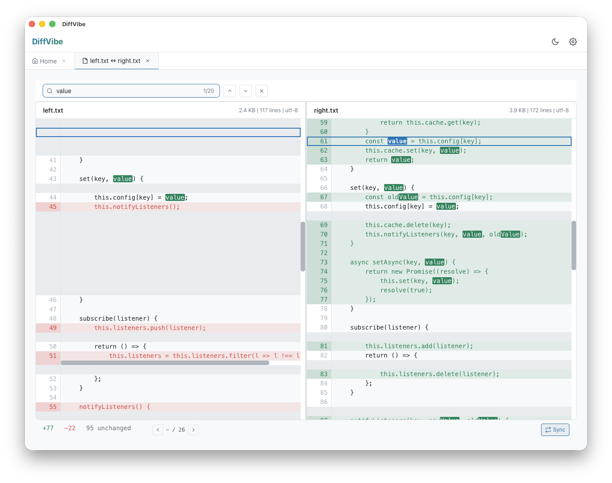

# DiffVibe

A fast, cross-platform visual diff and merge tool inspired by [Meld](https://meldmerge.org/).



## Features

- Two-way file comparison with synchronized scrolling
- Side-by-side diff view with inline change highlighting
- Character-level diff within changed lines
- Keyboard navigation between changes
- Search within diff view (Cmd/Ctrl+F)
- Tab support for multiple comparisons
- Dark mode

## Download

Grab the latest release from the [Releases page](https://github.com/whalen/diffvibe/releases):

- **macOS**: `.dmg` (Apple Silicon & Intel)
- **Linux**: `.AppImage`, `.deb`
- **Windows**: `.msi`, `.exe`

> **Note**: The app is unsigned. On macOS, right-click and select "Open" on first launch. On Windows, click "More info" → "Run anyway".

## Building from Source

Requires: [Rust](https://rustup.rs/), [Node.js](https://nodejs.org/), [pnpm](https://pnpm.io/)

```bash
# Install dependencies
pnpm install

# Run in development mode
pnpm tauri dev

# Build for production
pnpm tauri build
```

Or use [just](https://github.com/casey/just):

```bash
just install   # Install deps
just dev       # Dev mode
just build     # Production build
just release 0.1.0  # Tag and push release
```

## Git Integration

Use DiffVibe as your git difftool:

```bash
git config --global diff.tool diffvibe
git config --global difftool.diffvibe.cmd 'diffvibe "$LOCAL" "$REMOTE"'
git config --global difftool.prompt false
```

## Tech Stack

- [Tauri 2](https://tauri.app/) - Desktop app framework
- [Rust](https://www.rust-lang.org/) - Backend
- [Svelte 5](https://svelte.dev/) + [SvelteKit](https://kit.svelte.dev/) - Frontend
- [TypeScript](https://www.typescriptlang.org/) - Type safety

## Roadmap

- [ ] Three-way merge
- [ ] Directory comparison
- [ ] Syntax highlighting
- [ ] Inline editing with copy hunks between panes

## License

MIT License - see [LICENSE](LICENSE) for details.
